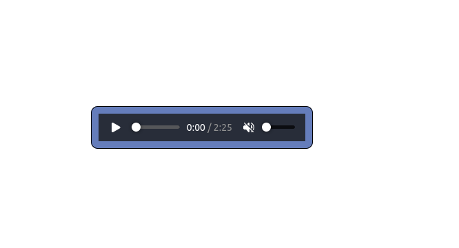

# PROJECT AUDIOPLAYER

This is simple audio controls build with HTML5.

## Screenchot

## Links

- Code File URL: [github.com](https://github.com/Jyotimoykathar/AudioPlayer)
- Live Site URL: [netlify.app](https://audioplayerhtml.netlify.app/)

## Useful resources

- [W3schools](https://www.w3schools.com/html/)

## Author

- Github page- [JyotimoyKathar](https://github.com/Jyotimoykathar/)
